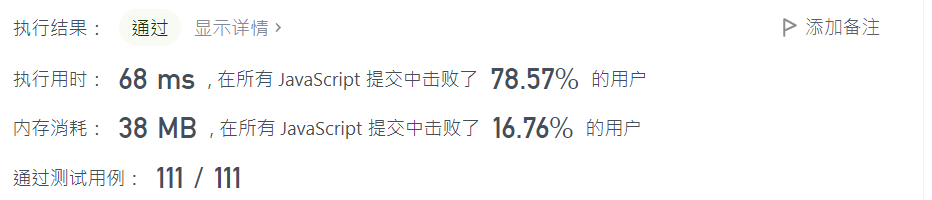

## plus-one


#### 题目描述

给定一个由 整数 组成的 非空 数组所表示的非负整数，在该数的基础上加一。

最高位数字存放在数组的首位， 数组中每个元素只存储单个数字。

你可以假设除了整数 0 之外，这个整数不会以零开头。


#### 示例

**示例 1：**

```
输入：digits = [1,2,3]
输出：[1,2,4]
解释：输入数组表示数字 123。
```

**示例 2：**

```
输入：digits = [4,3,2,1]
输出：[4,3,2,2]
解释：输入数组表示数字 4321。
```

**示例 3：**

```
输入：digits = [0]
输出：[1]
```


#### 解决方案

```js
var plusOne = function(digits) {
    let n = digits.length - 1

    for (let i = n; i >= 0; i--) { // i >= 0 要记得
        ++digits[i] // 这里是先累加再操作, 在这里先操作再++也可以
        digits[i] %= 10 // 很常见的套路

        if (digits[i] !== 0) {
            return digits
        }        
    }

    // 出现 [9,9], [9,9,9].... 等情况
    return [1, ...digits]
};
```


#### 执行结果

