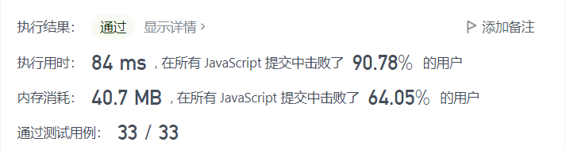

## Permutations-ii


#### Description

给定一个可包含重复数字的序列 `nums` ，**按任意顺序** 返回所有不重复的全排列。


#### Example

**example 1:**

```
输入：nums = [1,1,2]
输出：
[[1,1,2],
 [1,2,1],
 [2,1,1]]
```

**example 2:**

```
输入：nums = [1,2,3]
输出：[[1,2,3],[1,3,2],[2,1,3],[2,3,1],[3,1,2],[3,2,1]]
```

#### Solution

```js
var permuteUnique = function(nums) {
    nums.sort((a, b) => {
        return a - b
    })
    let result = []
    let path = []

    function backtracing( used) {
        if (path.length === nums.length) {
            result.push(path.slice())
            return
        }
        for (let i = 0; i < nums.length; i++) {
            if (i > 0 && nums[i] === nums[i - 1] && !used[i - 1]) {
                continue
            }
            if (!used[i]) {
                used[i] = true
                path.push(nums[i])
                backtracing(used)
                path.pop()
                used[i] = false
            }


        }
    }
    backtracing([])
    return result
};
```


#### Result

